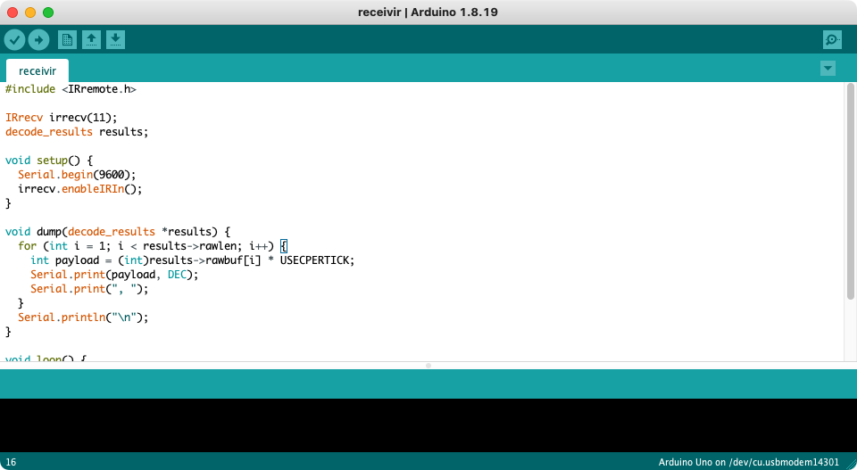
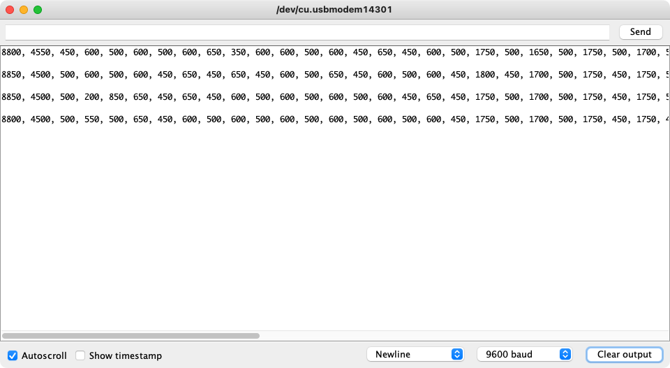

# <samp>OVERVIEW</samp>

Arduino project to capture raw inputs from any infrared remotes.
It requires an Arduino compatible board, a printer cable, an infrared receiver and three female-to-male jumper wires.

